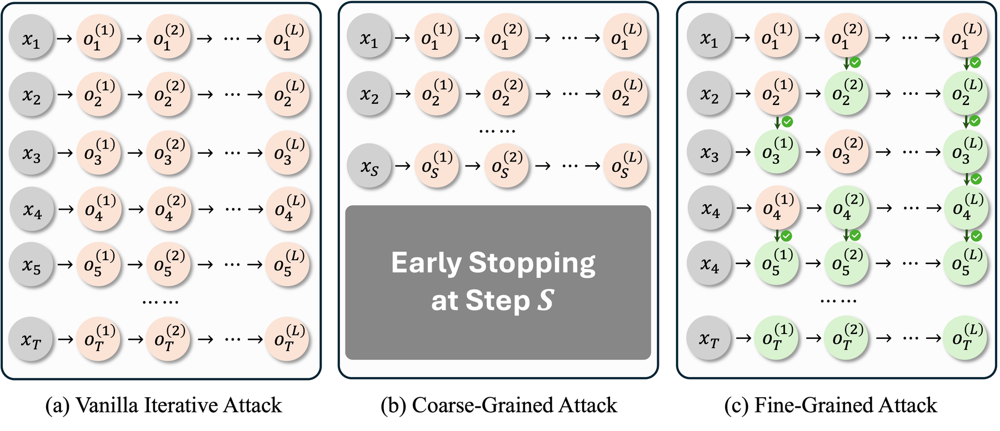
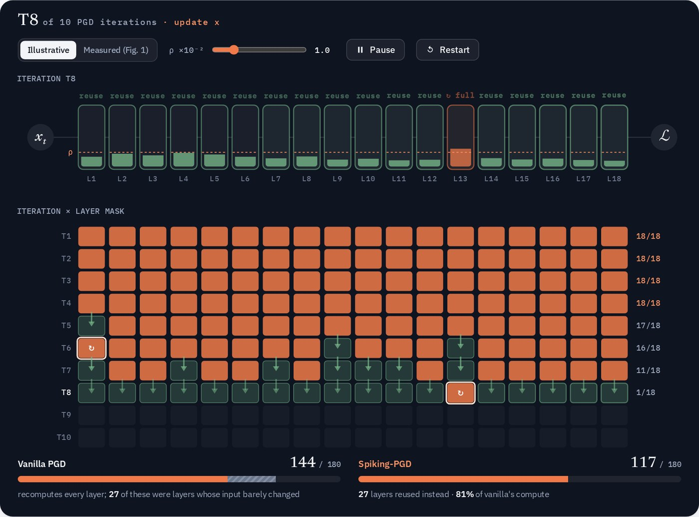
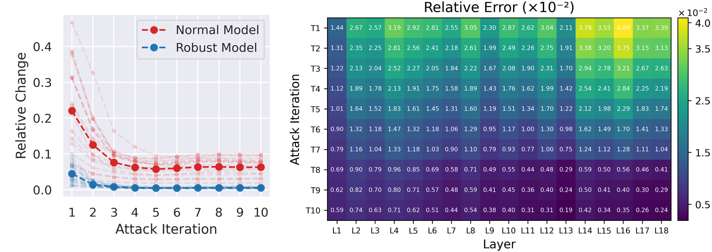
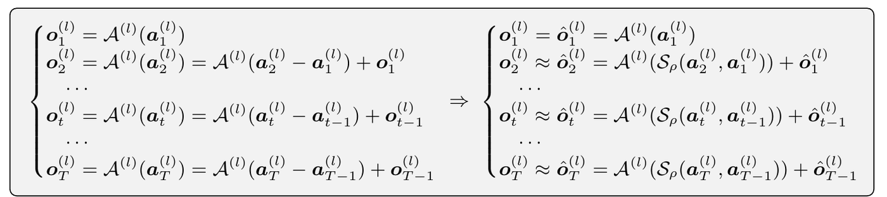
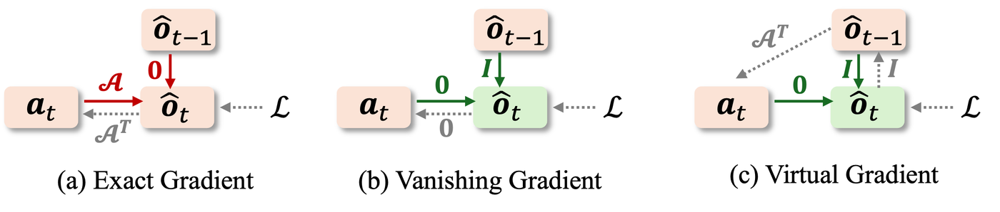
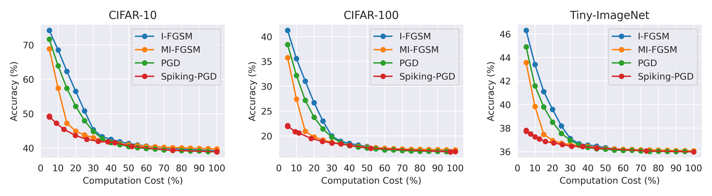
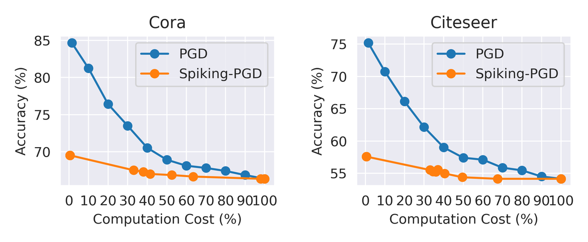
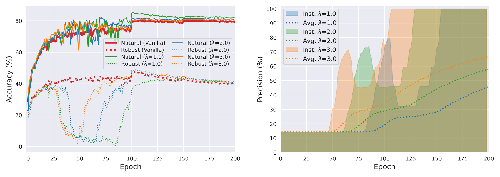
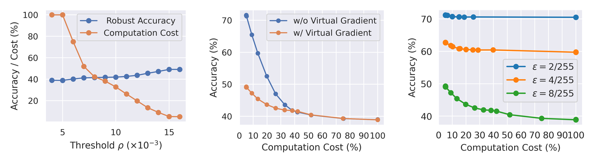

<div align="center">

# Fine-Grained Iterative Adversarial Attacks<br/>with Limited Computation Budget

[**Zhichao Hou**](mailto:zhou4@ncsu.edu) · [**Weizhi Gao**](mailto:wgao23@ncsu.edu) · [**Xiaorui Liu**](mailto:xliu96@ncsu.edu)

North Carolina State University

<a href="https://chris-hzc.github.io/spiking_attack/"></a>

[](https://iclr.cc/Conferences/2026)
[](https://chris-hzc.github.io/spiking_attack/)
[](https://arxiv.org/abs/2510.26981)
[](https://arxiv.org/pdf/2510.26981)
[](https://www.python.org/)
[](https://pytorch.org/)
[](LICENSE)



<p align="left"><b>Figure 1.</b> Three ways to spend a fixed attack budget. <b>(a)</b> Vanilla iterative attacks recompute every layer at every step. <b>(b)</b> Coarse-grained attacks simply stop early. <b>(c)</b> Our fine-grained <b>Spiking Iterative Attack</b> decides <i>per layer and per iteration</i> whether to recompute (<span>🟠</span>) or reuse (<span>🟢</span>) activations.</p>

</div>

---

> [!TIP]
> **🌐 Explore the interactive project page → [chris-hzc.github.io/spiking_attack](https://chris-hzc.github.io/spiking_attack/)**
>
> Watch Spiking-PGD decide layer by layer what to recompute, drag a compute budget across the results on five benchmarks, and replay 200 epochs of adversarial training.

## 🔥 TL;DR

> Given a **fixed computation budget**, how can we make an iterative adversarial attack as strong as possible?
>
> Instead of cutting iterations, **Spiking-PGD** recomputes a layer only when its input has changed enough (a *spike*), reuses the cached output otherwise, and keeps gradients alive through a **virtual surrogate gradient**. At equal cost it consistently beats early-stopped PGD, I-FGSM and MI-FGSM, and it makes **adversarial training up to 70% cheaper** without degrading clean or robust accuracy.

## 🌐 Interactive Project Page

<p align="center">
  <a href="https://chris-hzc.github.io/spiking_attack/"></a>
  <br/>
  <sub><b><a href="https://chris-hzc.github.io/spiking_attack/">Open the project page</a></b> · animated attack walkthrough · budget explorer on CIFAR-10/100, Tiny-ImageNet, Cora, Citeseer · adversarial-training replay</sub>
</p>

## 📰 News

- **[2026-10]** 🌐 [Interactive project page](https://chris-hzc.github.io/spiking_attack/) is live.
- **[2026]** 🎉 Accepted to **ICLR 2026**!
- **[2025-10]** Paper released on [arXiv](https://arxiv.org/abs/2510.26981). Code is public.

## 📖 Abstract

This work tackles a critical challenge in AI safety research under limited compute: given a fixed computation budget, how can one maximize the strength of iterative adversarial attacks? Coarsely reducing the number of attack iterations lowers cost but substantially weakens effectiveness. To fulfill the attainable attack efficacy within a constrained budget, we propose a fine-grained control mechanism that selectively recomputes layer activations across both iteration-wise and layer-wise levels. Extensive experiments show that our method consistently outperforms existing baselines at equal cost. Moreover, when integrated into adversarial training, it attains comparable performance with only 30% of the original budget.

## 🧠 Method

### 1. Observation: iterative attacks are highly redundant

Across PGD iterations, per-layer activations quickly stop changing, and the rate of change differs from layer to layer. Computing every layer at every step wastes most of the budget.

<p align="center"></p>
<p align="center"><sub>Relative activation change ‖a<sub>t</sub> − a<sub>t−1</sub>‖ / ‖a<sub>t</sub>‖ for ResNet-18 on CIFAR-10, across iterations (left) and layers (right).</sub></p>

### 2. Fine-grained budget allocation

Early stopping solves a *block-structured* special case of a richer problem. Let $\Delta = (\delta_{t,l}) \in \{0,1\}^{T\times L}$ mark whether layer $l$ is recomputed at iteration $t$:

$$
\max_{\Delta \in \{0,1\}^{T\times L}} \ \mathcal{L}\big(\boldsymbol{x}_{T+1}(\Delta),\, y\big)
\quad \text{s.t.} \quad \sum_{t=1}^{T}\sum_{l=1}^{L} C_{t,l}\,\delta_{t,l} \le C_{\text{total}}.
$$

Since early stopping is feasible for this problem, its optimum is never better: $V_{\text{coarse}} \le V_{\text{fine}}$ (Proposition 4.1).

### 3. Spiking forward computation

For a linear layer $\mathcal{A}^{(l)}$, the output is the previous output plus the response to the activation *residual*. A spiking gate with a single threshold $\rho$ decides whether that residual is worth computing:

<p align="center"></p>

$$
\mathcal{S}_\rho(\boldsymbol a_t, \boldsymbol a_{t-1}) =
\begin{cases}
\boldsymbol a_t - \boldsymbol a_{t-1}, & \|\boldsymbol a_t - \boldsymbol a_{t-1}\| / \|\boldsymbol a_t\| \ge \rho \quad \text{(fire → recompute)}\\
\boldsymbol 0, & \text{otherwise} \quad \text{(silent → reuse } \hat{\boldsymbol o}_{t-1}\text{)}
\end{cases}
$$

### 4. Virtual surrogate gradient

Naively reusing $\hat{\boldsymbol o}_{t-1}$ cuts the autograd graph and the gradient to the input **vanishes**. We restore it by routing the upstream gradient through the layer's adjoint, $\partial\mathcal L/\partial \boldsymbol a_t = \mathcal A^{\top}(\partial\mathcal L/\partial \hat{\boldsymbol o})$, implemented with `torch.nn.grad.conv2d_input` (conv) or a matrix product (linear).

<p align="center"></p>

## 📊 Results

<details open>
<summary><b>Attack strength vs. computation cost: vision (CIFAR-10 / CIFAR-100 / Tiny-ImageNet)</b></summary>
<p align="center"></p>
<p>Lower accuracy under attack means a stronger attack. Spiking-PGD is the strongest attack at every budget, with the largest gap in the low-compute regime.</p>
</details>

<details>
<summary><b>Structure attacks on graphs (Cora / Citeseer, GCN)</b></summary>
<p align="center"></p>
</details>

<details open>
<summary><b>Efficient adversarial training (CIFAR-10)</b></summary>
<p align="center"></p>
<p>With an exponentially decaying threshold $\rho(t)=\rho_0\,\frac{e^{-\lambda t/N}-e^{-\lambda}}{1-e^{-\lambda}}$ and $\lambda=2$, Spiking-PGD-AT nearly matches PGD-AT in best clean and robust accuracy using <b>under 30% of the computation</b>.</p>
</details>

<details>
<summary><b>Ablations: threshold ρ, virtual gradient, attack radius ε</b></summary>
<p align="center"></p>
</details>

## ⚙️ Installation

```bash
git clone https://github.com/chris-hzc/spiking_attack.git
cd spiking_attack

conda create -n spiking python=3.10 -y && conda activate spiking
pip install -r requirements.txt
```

## 📁 Data Preparation

CIFAR-10 / CIFAR-100 are downloaded automatically to `./data`. For **Tiny-ImageNet**:

```bash
wget http://cs231n.stanford.edu/tiny-imagenet-200.zip -P data && unzip -q data/tiny-imagenet-200.zip -d data
python scripts/prepare_tinyimagenet.py --root data/tiny-imagenet-200
```

## 🚀 Quick Start

### Spiking-PGD as a drop-in module

`SpikingModel` wraps any `nn.Module`: every `Conv2d` / `Linear` becomes a `SpikingModule`, and BatchNorm is folded into the preceding layer.

```python
import torch, torch.nn.functional as F
from models import resnet18
from spiking import SpikingModel

net = resnet18(num_classes=10)
net.load_state_dict(torch.load("ckpt.pth")["net"])
model = SpikingModel(net, rho=0.02).cuda().eval()   # rho: spiking threshold

def spiking_pgd(model, x, y, eps=8/255, alpha=2/255, steps=20):
    model.reset_state(); model.reset_precision_tracking(); model.set_spiking_state(True)
    x_adv = (x + torch.empty_like(x).uniform_(-eps, eps)).clamp(0, 1)
    for _ in range(steps):
        x_adv.requires_grad_()
        grad, = torch.autograd.grad(F.cross_entropy(model(x_adv), y), x_adv)
        x_adv = (x_adv.detach() + alpha * grad.sign()).clamp(x - eps, x + eps).clamp(0, 1)
    return x_adv

x_adv = spiking_pgd(model, x, y)
print(f"relative cost: {model.get_precision()['overall']:.1%}")   # fraction of layers recomputed
```

### Evaluate an attack

```bash
python spiking_attack.py --dataset cifar10 --checkpoint path/to/ckpt.pth \
    --epsilon 8 --step_size 2 --steps 20 --rho 0.02
```

| Argument | Meaning |
| :-- | :-- |
| `--rho` | Spiking threshold $\rho$. Larger values mean more reuse, lower cost, and a slightly weaker attack. |
| `--epsilon`, `--step_size` | $\ell_\infty$ radius and step size, in units of $1/255$ |
| `--steps` | Number of attack iterations $T$ |
| `--dataset` | `cifar10`, `cifar100`, or `imagenet` (Tiny-ImageNet) |

### Adversarial training with Spiking-PGD

```bash
python spiking_train.py --dataset cifar10 --epochs 200 --steps 10 \
    --rho_initial 0.1 --schedule exponential --lambda_decay 2.0
```

### Reproduce the sweeps

```bash
bash scripts/run_attack.sh      # ρ / ε / T sweeps for Spiking-PGD
bash scripts/run_train.sh       # constant vs. exponential ρ schedules for AT
python compare_with_baseline.py # Spiking-PGD vs. PGD at matched budget
python visualize_spiking.py     # per-layer spiking statistics
```

See [`docs/resnet50.md`](docs/resnet50.md) for experiments with a pretrained ResNet-50.

## 🗂️ Repository Structure

```
spiking_attack/
├── spiking/                    # ⭐ core library
│   ├── spiking_layer.py        #   SpikingModule: spiking gate + virtual surrogate gradient
│   ├── spiking_model.py        #   SpikingModel wrapper, ThresholdScheduler
│   └── fold_bn.py              #   BatchNorm folding
├── models/                     # ResNet / RegNet / MobileNetV2 / MNASNet backbones
├── spiking_attack.py           # attack evaluation
├── spiking_train.py            # Spiking-PGD adversarial training
├── compare_with_baseline.py    # Spiking-PGD vs. PGD
├── visualize_spiking.py        # spiking statistics & plots
├── test_resnet50_spiking.py    # pretrained ResNet-50 experiments
├── scripts/                    # experiment launchers & data prep
├── docs/                       # extra guides
└── assets/                     # figures
```

## 📝 Citation

If you find this work useful, please consider citing:

```bibtex
@inproceedings{hou2026fine,
  title={Fine-Grained Iterative Adversarial Attacks with Limited Computation Budget},
  author={Hou, Zhichao and Gao, Weizhi and Liu, Xiaorui},
  booktitle={International Conference on Learning Representations},
  volume={2026},
  pages={75235--75250},
  year={2026}
}
```

## 📬 Contact

Questions and discussion are welcome via [GitHub issues](https://github.com/chris-hzc/spiking_attack/issues) or email: Zhichao Hou ([zhou4@ncsu.edu](mailto:zhou4@ncsu.edu)).

## 📄 License

This project is released under the [MIT License](LICENSE).
